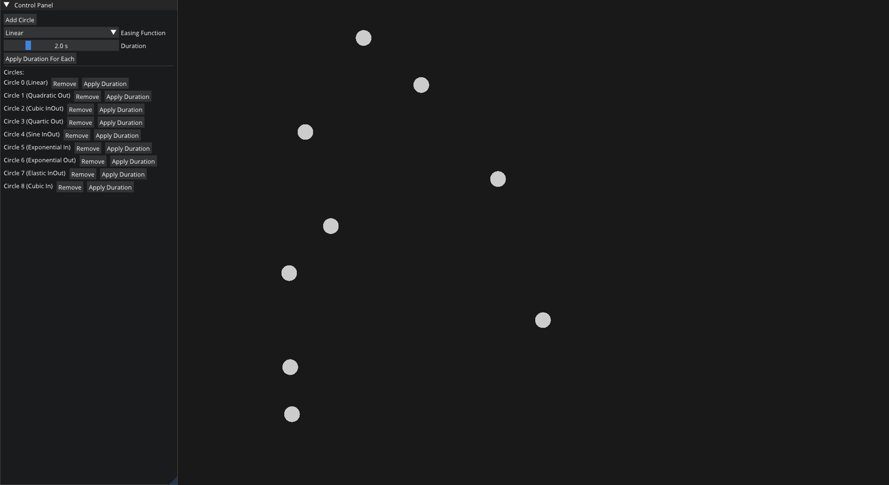

# Twease-Visualizer

## Overview
Twease-Visualizer is an application designed to showcase the control and manipulation of animation parameters, focusing on easing functions and animation duration management. This tool provides a user-friendly interface for adding, removing, and adjusting animation objects in real-time.

Built upon the Qbit-App-Template, a game engine template developed by [Qbit](https://github.com/EmomaxD/Qbit).

Twease-Visualizer leverages the power of the [Twease](https://github.com/EmomaxD/Twease) library for handling various easing functions seamlessly.

## Features
- Select from a wide range of over 30 predefined easing functions for animations.
- Dynamically adjust the duration of animations using an intuitive slider interface.
- Add and remove animation objects on-the-fly to test different scenarios.
- Apply a uniform duration setting to all existing animation objects with a single operation.

## Getting Started
To get started with Twease-Visualizer, follow these steps:
1. Clone the repository with --recursive option.
2. Open up the Qbit-App solution and Run!
3. Use the GUI to interact with animation parameters and observe real-time results.

